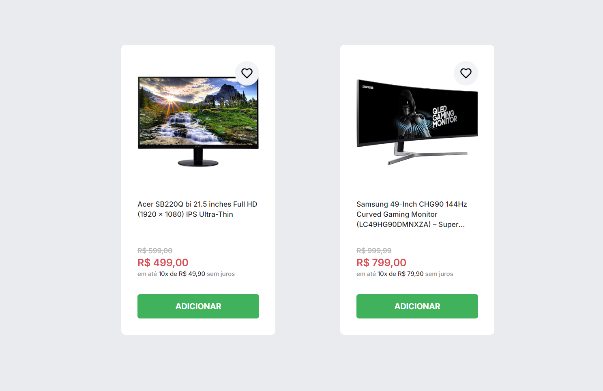

# B8one Challenge

Essa é uma solução para o teste técnico da vaga na b8one. Este projeto é uma aplicação de e-commerce onde os usuários podem gerenciar seus produtos favoritos e suas compras de forma prática e intuitiva. A aplicação permite que os usuários adicionem e removam produtos tanto do carrinho de compras quanto da wishlist, com feedback visual através de notificações Toast. As informações sobre os produtos são armazenadas no localStorage, garantindo que as preferências do usuário sejam mantidas entre as sessões de navegação.



## Índice

- [Visão Geral](#visao-geral)
  - [O desafio](#o-desafio)
  - [Como rodar o projeto](#como-rodar-o-projeto)
  - [Links](#links)
- [Meu processo](#meu-process)
  - [Funcionalidades](#funcionalidades) 
  - [Tecnologias Utilizadas](#tecnologias-utilizadas)
- [Autora](#autora)


## Visão Geral

### O desafio

Requisitos do desafio:

 - Criar um array de produtos com dois objetos: cada objeto deve conter os atributos necessários conforme layout
 - Renderizar esses produtos dentro da div className "App"
 - Fazer a estilização e implementação conforme layout
 - Subir o projeto em alguma infra: Vercel, Netlify, Heroku ou qualquer outra de preferência.

## Meu processo

### Funcionalidade

- Adicionar ao Carrinho: Os usuários podem adicionar produtos ao carrinho clicando no botão "Adicionar". O produto será armazenado e exibido no carrinho de compras.
- Remover do Carrinho: Produtos no carrinho podem ser removidos com um simples clique, e a lista será atualizada automaticamente.
- Adicionar à Wishlist: Para adicionar um produto à wishlist, basta clicar no ícone de coração. O produto será salvo na lista de desejos do usuário.
- Remover da Wishlist: Itens da wishlist podem ser removidos facilmente, e a lista será atualizada em tempo real.
- Feedback Visual: Sempre que um produto for adicionado ou removido do carrinho ou da wishlist, uma notificação (Toast) aparecerá no canto inferior direito da tela, confirmando a ação.
- Persistência de Dados: Todos os produtos adicionados ao carrinho ou à wishlist são armazenados no localStorage do navegador. Isso garante que, ao recarregar a página ou fechar o     navegador, os dados permanecem intactos e sincronizados com as ações anteriores do usuário.

### Tecnologias utilizadas

- [ReactJS](https://pt-br.react.dev/blog/2023/03/16/introducing-react-dev)
- [Vite](https://vitejs.dev/)
- [Tailwind CSS](https://tailwindcss.com/)
- [TypeScript](https://www.typescriptlang.org/)


## Como rodar o projeto

```bash

# Clone este repositório
$ git clone https://github.com/maria-luiza-rodrigues-ti/b8one-challenge 

# Vá para a pasta da aplicação Front End
$ cd b8one-challenge

# Instale as dependências
$ npm install
ou
$ yarn install

# Execute a aplicação em modo de desenvolvimento
$ npm run dev
ou
$ yarn dev

    Abra [http://localhost:3000](http://localhost:3000) no seu navegador para ver os resultados.

```

---

## Links

- URL: [https://maria-luiza-rodrigues-ti.github.io/b8one-challenge/](https://maria-luiza-rodrigues-ti.github.io/b8one-challenge/)
  

## Author

- [@maria-luiza-rodrigues-ti](https://www.frontendmentor.io/profile/maria-luiza-rodrigues-ti)

